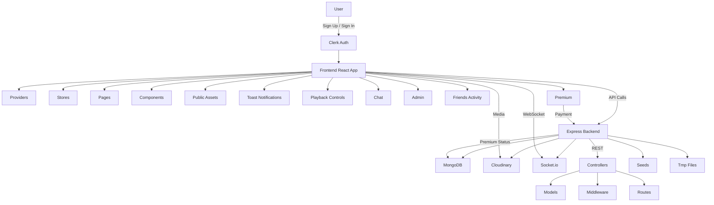

# MelodyMe Project Documentary

## Overview
MelodyMe is a full-stack music streaming and social platform designed to deliver a seamless listening experience and foster user interaction. The project combines a modern React/TypeScript frontend with a Node.js/Express backend, integrating real-time chat, authentication, and media playback features. The architecture is modular, scalable, and optimized for both desktop and mobile devices.

## Architecture & Structure

### 1. Frontend
- **Tech Stack:** React, TypeScript, Vite, Zustand (state), Clerk (auth), Tailwind CSS, Radix UI, react-hot-toast
- **Key Features:**
  - Responsive layouts for all screens
  - Music playback controls with queue, shuffle, repeat, and volume
  - Real-time chat with user list, unread counts, and message input
  - Authentication and protected actions (e.g., playback requires login)
  - Toast notifications for feedback
- **Directory Layout:**
  - `src/`
    - `components/` – UI primitives, skeletons, and reusable elements
    - `layout/` – Main app layout, including sidebars and playback bar
    - `lib/` – Utility functions and API clients
    - `pages/` – Route-based pages (home, album, chat, admin, etc.)
    - `providers/` – Context providers (e.g., AuthProvider)
    - `stores/` – Zustand stores for state management
    - `types/` – TypeScript type definitions
    - `public/` – Static assets (album covers, songs)
  - Config files: `tailwind.config.js`, `vite.config.ts`, `tsconfig.json`, etc.

### 2. Backend
- **Tech Stack:** Node.js, Express, Clerk (auth), Cloudinary (media), Socket.io (real-time)
- **Key Features:**
  - RESTful API for albums, songs, users, stats, and admin actions
  - Real-time messaging via WebSockets
  - Authentication middleware for protected routes
  - Cloudinary integration for media uploads
  - Seed scripts for initial data
- **Directory Layout:**
  - `src/`
    - `controller/` – Route handlers for business logic
    - `lib/` – Database, cloud, and socket utilities
    - `middleware/` – Auth and other middlewares
    - `models/` – Mongoose models for data entities
    - `routes/` – Express route definitions
    - `seeds/` – Data seeding scripts
    - `tmp/` – Temporary files
  - Config files: `package.json`, etc.

## Design Principles
- **Modularity:** Each feature is encapsulated in its own component, store, or controller for maintainability.
- **Responsiveness:** Layouts adapt to all device sizes, with special attention to mobile usability (e.g., sticky message input, scrollable chat).
- **Security:** Authentication is enforced for sensitive actions (e.g., playback, messaging).
- **User Experience:** Feedback is provided via toasts, skeleton loaders, and smooth transitions.
- **Scalability:** The structure supports easy addition of new features (e.g., playlists, friends activity).

## Key Flows
- **Authentication:** Users sign up/in via Clerk; protected actions check login state and show toasts if unauthorized.
- **Music Playback:** Playback bar supports play/pause, next/prev, shuffle, repeat, and volume. Controls are guarded by auth.
- **Chat:** Real-time messaging with scroll-to-bottom, unread counts, and responsive input box.
- **Admin:** Admin routes and pages for managing content.

## Flowchart

## Premium Section
- Styled like [Spotify Premium](https://open.spotify.com/premium)
- User selects a plan and payment method
- Redirects to payment details page for entry
- After payment, user is granted premium access immediately
- System automatically detects paid users and restricts access for non-premium users

## Setup & Deployment
- **Frontend:**
  - Install dependencies: `npm install`
  - Run dev server: `npm run dev`
  - Build for production: `npm run build`
- **Backend:**
  - Install dependencies: `npm install`
  - Start server: `npm start`
  - Seed data: `node seeds/albums.js`, `node seeds/songs.js`

## Extensibility
- Add new pages/components in `src/pages` or `src/components`
- Extend backend by adding new controllers, models, and routes
- Integrate additional services (e.g., payment, analytics) via `lib/`

## Summary
MelodyMe is a robust, modern music and social platform built for extensibility, security, and a delightful user experience. Its modular design and clear separation of concerns make it easy to maintain and grow.